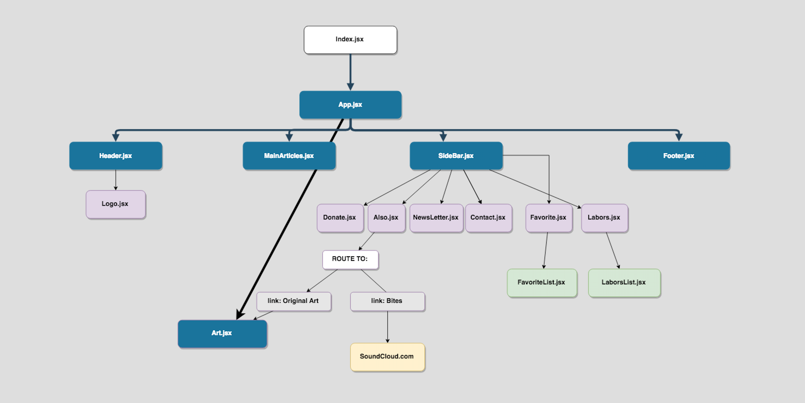

# Brain Pickings

#### a React site clone by Krystal Foster
#### Nov. 9, 2018

### Description

This project is an extension of a former project I initially made in Angular. It has been reconstituted and styled using JSX and the React library. The project was first cloned off the online newsletter, [Brain Pickings](https://www.brainpickings.org/) using TypeScript and angular components, but here I have integrated it all into React.

### Questions, Concerns

  I will document any issues or questions that arise during today's process here.
  
### Notes on the Process:

  I have a rough idea how this clone can be implemented in React, but I will adjust my expectations as I work today. I think that much of the organization will resemble how I worked in Angular, but the components that require data will each need their own components to feed off. These will contain arrays of mock data objects that will be much like the hard-coded data in Angular, but instead of TypeScript looping I will just map through these objects with new JSX syntax. 
  
  CSS styling multi-components in the context of React will be fun to figure out, but other than some syntax differences I don't foresee any major changes from Angular. The concept and style organization between components is similar to Angular in terms of overall modularity. The main difference I see is that in React, extra css files are not needed for each component and css can be worked into the jsx file itself using css objects or style literals. It's nice to see React handle all these aspects of the view in one file.  

### Screen Shots

Here is a basic component tree to demonstrate what I'm thinking. Will be updated as needed. 

#### Here is the updated component tree. There is a new stateful feature lifting up to MainArticles.jsx that lets a user add a new article to the main articles section. 

## Current Overall Structure

1. The program features a main article section that I would like to be informed by a database, but currently I am not sure how to pass content that includes multiple html elements and unique composition into a firebase argument. I initially had it feeding from the database but for now, it is hard-coded as a placeholder. I will revisit this feature once I know how to do pass all media properly.

2. The program features a SideBar that contains multiple components, three of them successfully fed off the central firebase database (in Angluar), however as I transition this project into React, I will be providing a mock database until next week. 

3. The first component in the SideBar is a donation section. It does not change or require a constructor, so it is hard-coded and styled within its own component.

4. The second component contains the newsletter form. Again, these do not update with new information so they will be hard-coded and composed in their own space.

5. The third component in the SideBar is an About and Contact section. These will only provide external hyperlinks so will be managed with hard code, but I'd like to practice routing on these elements. 

6. The fourth SideBar component is an "Also" section that directs users to other additional media on the website.

7. The sixth SideBar component is a "Favorite Reads" section. This is also a data-informed list that previews the most popular articles up-to-date. It will retrieve its contents via a mock database until next week. I will probably use props to model this information. 

8. "Labors of Love" is the ninth component that also draws from another list in the database.

9. Another component is the logo banner at the top.

10. The last component is the footer section, which again will be made its own component but will not need props or any additional stateful fussings.

## New Features

11. I have added three new components that allow a user to add a new article to the main feed. State is lifted from these components into MainArticles.jsx, which is the only necessary state component I need so far. 

## Future Goals

I would like to incorporate a working admin component that handled all of the new posts instead of it being open, but for now I am satisfied just using this project to practice unidirectional data and state configuration in any way I can. 

### Technologies and Resources

* JavaScript
* HTML
* ESlint
* Babel
* NPM
* React
* JSX

### Setup Instructions

First, make sure you have node package manager installed globally. Check out https://www.npmjs.com/get-npm for information on that.

#### Then:

`$ git clone https://github.com/Eucile/brain-pickings`

`$ cd brain-pickings`

`$ npm install`

`apm install react@0.16.2`

`$ npm run start`

### License

Copyright (c) 2018 **_{ Krystal Foster}_**
